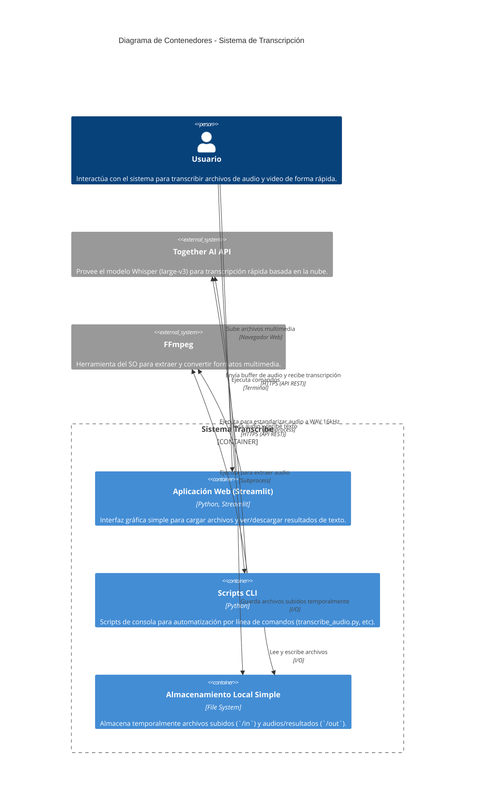
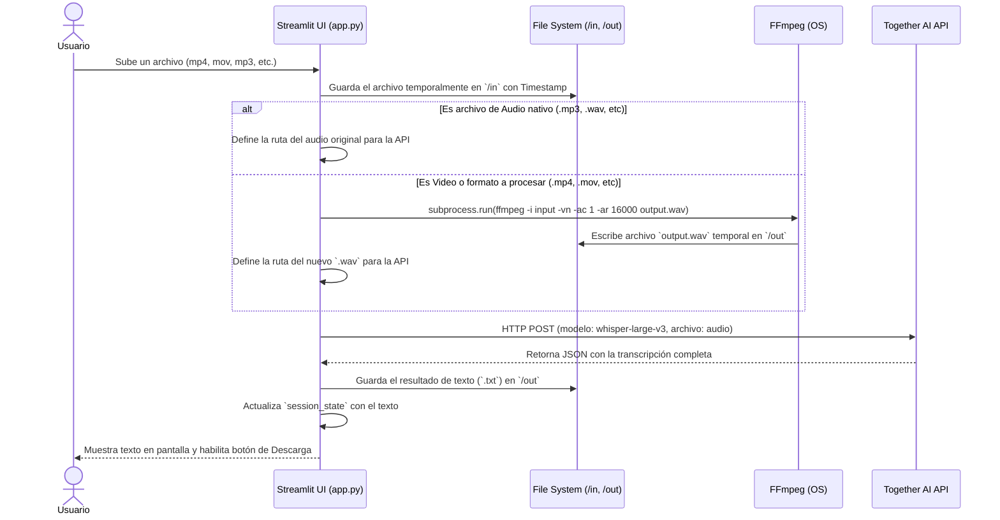

# Arquitectura del Sistema: Transcribe (Herramienta Ligera) 

## 1. Visión General de la Arquitectura (C4 Model)

## 2. Flujo de Ejecución Detallado (Diagrama de Secuencia)

El siguiente diagrama detalla la lógica condicional empleada por Streamlit y el pre-procesamiento del archivo subido.

## 3. Gestión de Estado en Streamlit

Debido a que Streamlit recarga el script en cada interacción del usuario (como al hacer click en un botón de descarga), se utiliza un mecanismo de `session_state` para evitar volver a transcribir el mismo archivo accidentalmente.

- **`st.session_state["file_id"]`**: Se genera un identificador único basado en el nombre y tamaño del archivo (`f"{uploaded_file.name}_{uploaded_file.size}"`).
- **Verificación**: Si el `file_id` actual coincide con el de `session_state`, Streamlit no ejecuta de nuevo el proceso de FFmpeg ni la petición a la API. Directamente renderiza el texto almacenado en memoria.
- **`st.session_state["transcript_text"]`** y **`st.session_state["out_filename"]`**: Almacenan el resultado final y el nombre del archivo para renderizar de manera segura el botón `st.download_button`.

## 4. Componentes Clave

* **`src/app.py`**: El punto de entrada principal para la interfaz gráfica.
* **`key.env`**: Archivo de entorno local (no subido a git) para inyectar `TOGETHER_API_KEY`.
* **Requerimientos del Sistema**: Requiere `ffmpeg` instalado globalmente en la máquina del usuario o servidor que ejecute Streamlit. No requiere base de datos alguna.
