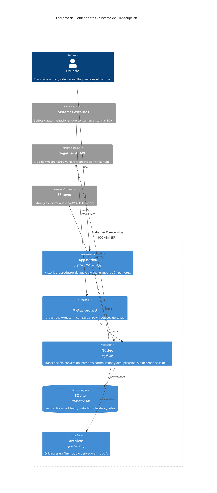

# Arquitectura del Sistema: Transcribe

Herramienta local de transcripción de audio y video con Whisper (Together AI),
con **interfaz nativa** (Qt) y **CLI** para automatización máquina-máquina.

## 1. Visión general



## 2. Módulos

| Archivo | Responsabilidad |
|---|---|
| `src/core.py` | Transcripción, conversión ffmpeg, nombres, dedup, idiomas. Sin UI. |
| `src/db.py` | Esquema SQLite, consultas, borrado con archivos asociados. |
| `src/gui.py` | Interfaz nativa Qt: historial, reproductor, lotes. |
| `src/cli.py` | Interfaz de línea de comandos para automatización. |

Cuatro módulos, sin scripts sueltos: la normalización de nombres vive en
`core.py` (`slugify`), junto al resto de la lógica que comparten GUI y CLI.

## 3. Decisiones de diseño

**La BD es la fuente de verdad.** El texto vive en `transcribe.db`, no en archivos
`.txt` sueltos. Evita mantener dos copias sincronizadas: retranscribir actualiza
un único lugar y la descarga se genera al vuelo.

**Deduplicación por hash SHA-256.** Un archivo ya transcrito se reconoce aunque
cambie de nombre, y no se gasta una llamada a la API.

**Nombres normalizados.** Esquema `<tipo>_<AAAAMMDD-HHMM>_<slug>_<formato>`,
aplicado por igual desde la GUI y el CLI.

**Idioma opcional.** Forzar un idioma incorrecto produce transcripciones
alucinadas, así que se puede dejar que Whisper lo detecte.

**Núcleo sin UI.** `core.py` no importa Qt ni nada de presentación, de modo que
la GUI y el CLI comparten exactamente el mismo comportamiento.

**Conversión con consentimiento.** El reproductor del sistema no decodifica
VP9 ni AV1. Al importar un vídeo así, la app avisa antes de empezar y ofrece
convertirlo a H.264, transcribirlo tal cual (el audio se procesa igual de
bien) o cancelar. Nunca se convierte sin preguntar: recodificar tiene pérdida
y duplica el espacio. El original siempre se conserva.

Para entradas ya guardadas, el menú ofrece la misma conversión y abrir el
archivo con el reproductor del sistema.

## 4. Formatos

- **Sin conversión** (van directos a la API): `.mp3`, `.wav`, `.flac`, `.m4a`
- **Con ffmpeg** → WAV 16kHz mono: todo lo demás, incluidos `.opus` de WhatsApp,
  `.webm`, `.mp4`, `.mov`, `.amr`, `.3gp`

## 5. Uso

```bash
# Interfaz nativa
python3 src/gui.py

# CLI
python3 src/cli.py run audio.opus -l es
python3 src/cli.py --json list
python3 src/cli.py show 18
python3 src/cli.py redo 25 -l en
python3 src/cli.py --json rm 25 --original
```

Códigos de salida del CLI: `0` correcto, `1` error de uso, `2` fallo de
transcripción, `3` no encontrado. Con `--json`, stdout es JSON puro y el
progreso va a stderr.
